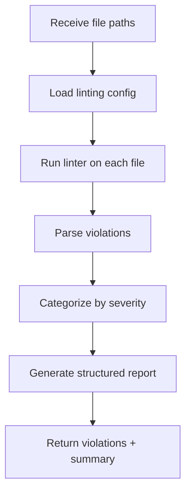

# 📚 Skill Development Guide - Hands-On Examples

## Part 1: Skill Anatomy - Deep Dive

### Complete Skill Definition Template

```yaml
---
name: SkillName
version: 1.0.0
description: One-line description of what this skill does
category: development | testing | documentation | deployment | architecture
complexity: low | medium | high
time_estimate: "5 min" | "15 min" | "1 hour"
authors: 
  - Your Name
  - Collaborator
tags: [automated, requires-approval, parallelizable]

# Prerequisites
preconditions: |
  - Repository has ESLint configured
  - Node.js >= 16
  - Test framework installed

# Inputs and outputs
inputs:
  file_paths:
    type: array[string]
    description: List of files to check
    required: true
  config_override:
    type: object
    description: Linting rules to override
    required: false
    example: { "no-console": "error" }

outputs:
  success:
    type: object
    schema: |
      {
        violations: [
          { file, line, column, rule, message, severity }
        ],
        summary: { total, critical, warning, info },
        passed: boolean
      }
  failure:
    type: object
    schema: |
      { error, reason, retry_suggestion }

# Tools and agents
tools_required: ['edit', 'search/codebase', 'run']
agents_who_call_this: [Reviewer, Developer]
skills_this_calls: [Detect-Breaking-Changes]  # can chain skills
depends_on_agents: []

# Integration
integration_example: |
  Reviewer calls this after Developer finishes.
  If violations found, Reviewer reports them.
  Developer fixes, re-runs Reviewer, re-calls this skill.

# Configuration
configuration:
  required_passing_rate: 100  # % of checks that must pass
  auto_fix: false  # can this auto-fix violations?
  parallelizable: true  # can this run on multiple files in parallel?

---

# Skill: Code-Quality-Check

## What This Skill Does

Runs automated linting, style checking, and code analysis tools against provided files. Returns structured violation list organized by severity.

**Key feature**: Separates "blocking" violations (must fix) from "should fix" (improvements).

## When to Use It

- After Developer finishes writing code
- In Reviewer agent to automate style checking
- In CI/CD pipeline before merge
- To enforce team coding standards

## How It Works



## Step-by-Step Process

### Step 1: Validate Inputs
```
if file_paths is empty:
  return error: "No files provided"
if files don't exist:
  return error: "Files not found: [list]"
```

### Step 2: Load Configuration
```
Read .eslintrc.json or eslint.config.js
Apply config_override if provided
Log effective config
```

### Step 3: Run Linter
```
for each file in file_paths:
  run: eslint {file} --format json
  capture: exit_code, stdout, stderr
```

### Step 4: Parse and Categorize
```
Parse ESLint JSON output
For each violation:
  rule_severity = config[rule] || 'warn'
  if rule_severity == 'error':
    category = 'blocking'
  elif rule_severity == 'warn':
    category = 'should_fix'
  else:
    category = 'info'
```

### Step 5: Generate Summary
```
blocking_count = count violations where category == 'blocking'
should_fix_count = count violations where category == 'should_fix'
total_violations = count all

return: {
  violations: [detailed list],
  summary: {
    total: total_violations,
    blocking: blocking_count,
    should_fix: should_fix_count,
    files_checked: len(file_paths),
    passed: blocking_count == 0
  }
}
```

## Input & Output Examples

### Input Example
```json
{
  "file_paths": [
    "src/newFeature.ts",
    "src/utils.ts",
    "tests/newFeature.test.ts"
  ],
  "config_override": {
    "no-console": "off"
  }
}
```

### Output Example (Success)
```json
{
  "violations": [
    {
      "file": "src/newFeature.ts",
      "line": 42,
      "column": 8,
      "rule": "prefer-const",
      "message": "'temp' is never reassigned. Use 'const' instead.",
      "severity": "warn",
      "category": "should_fix"
    }
  ],
  "summary": {
    "total": 1,
    "blocking": 0,
    "should_fix": 1,
    "info": 0,
    "files_checked": 3,
    "passed": true
  },
  "passed": true
}
```

### Output Example (Failure)
```json
{
  "violations": [
    {
      "file": "src/newFeature.ts",
      "line": 12,
      "column": 5,
      "rule": "no-var",
      "message": "Variable 'x' should be declared with 'let' or 'const'.",
      "severity": "error",
      "category": "blocking"
    }
  ],
  "summary": {
    "total": 1,
    "blocking": 1,
    "should_fix": 0,
    "passed": false
  },
  "passed": false
}
```

## Edge Cases & Handling

### Edge Case 1: File doesn't exist
```
Input: file_paths: ["src/missing.ts"]
Output: {
  error: "File not found",
  reason: "src/missing.ts does not exist in repository",
  retry_suggestion: "Verify file paths and commit status"
}
```

### Edge Case 2: No linting config found
```
Action: Fall back to ESLint defaults
Log: "No custom config found, using ESLint defaults"
Continue: Process all files
```

### Edge Case 3: Linter crashes
```
Catch linter process error
Return: {
  error: "Linter process failed",
  reason: stderr output,
  retry_suggestion: "Check linting config validity"
}
```

### Edge Case 4: Very large file (> 10k lines)
```
Action: Still process but note in summary
Log: "File {name} is large ({lines} lines), linting may be slow"
Warning: Include in output summary
```

## Agent Integration Points

### How Developer Uses This

```markdown
Developer.agent calls this skill:
1. Finishes implementing code
2. Invokes: Code-Quality-Check
   Input: [list of new/modified files]
3. If skill.output.passed == true:
   → Continue to next step
4. If skill.output.passed == false:
   → If blocking violations:
     Fix them → Re-run skill
   → If only should_fix:
     Note them in report
```

### How Reviewer Uses This

```markdown
Reviewer.agent checks Developer's code:
1. Receives Developer's change summary
2. Invokes: Code-Quality-Check
   Input: [changed files from Developer]
3. Analyzes output:
   - violations.blocking → report as "blocking"
   - violations.should_fix → report as "should_fix"
   - passed == false → recommend fixes
4. Reports back to BrainBox
```

## Testing Strategy

### Test Case 1: Happy Path
```gherkin
Given: A valid TypeScript file with perfect code
When: Code-Quality-Check runs
Then: violations is empty array
And: summary.passed == true
And: summary.total == 0
```

**Test file**: `tests/perfect.ts`
```typescript
const message: string = "Hello, World!";

function greet(name: string): string {
  return `Hello, ${name}!`;
}

export { greet };
```

### Test Case 2: Blocking Violation
```gherkin
Given: A file with 'var' keyword
When: Code-Quality-Check runs
Then: violations contains 1 item
And: violations[0].severity == "error"
And: violations[0].rule == "no-var"
And: summary.blocking == 1
And: summary.passed == false
```

**Test file**: `tests/blocking-var.ts`
```typescript
var x = 5;  // should use const
```

### Test Case 3: Should-Fix Violation
```gherkin
Given: A file with reassignable const
When: Code-Quality-Check runs
Then: violations[0].severity == "warn"
And: violations[0].rule == "prefer-const"
And: summary.should_fix == 1
And: summary.passed == true
```

**Test file**: `tests/should-fix.ts`
```typescript
let message = "Hello";  // could be const
```

### Test Case 4: Multiple Files
```gherkin
Given: 3 files with mix of violations
When: Code-Quality-Check runs with all 3 paths
Then: violations.length > 0
And: summary.files_checked == 3
And: Violations grouped correctly by file
```

### Test Case 5: Config Override
```gherkin
Given: File with console.log but config overrides to 'off'
When: Code-Quality-Check runs with config_override
Then: violations excludes console.log rule
And: Other violations still reported
```

---

## Part 2: Creating Your First Skill (Hands-On)

### Exercise: Create "Test-Coverage-Report" Skill

#### Step 1: Define the Skill File

Create: `skills/test-coverage-report.md`

```yaml
---
name: Test-Coverage-Report
version: 1.0.0
description: Measure test coverage against acceptance criteria
category: testing
complexity: medium
time_estimate: "10 min"
authors: [Your Name]
tags: [automated, reporting]

preconditions: |
  - Test framework installed (Jest, Mocha, etc.)
  - Coverage reporter configured
  - Acceptance criteria documented

inputs:
  acceptance_criteria:
    type: array[string]
    description: List of requirements that must be tested
    required: true
  test_framework:
    type: string
    description: "jest | mocha | pytest"
    required: false
    default: "jest"

outputs:
  success:
    schema: |
      {
        overall_coverage: number,  // 0-100
        coverage_by_type: {
          statements: number,
          branches: number,
          functions: number,
          lines: number
        },
        untested_criteria: array[string],
        uncovered_files: array[{ file, coverage, target }],
        passed: boolean
      }

tools_required: ['runTests', 'search/codebase', 'read/terminalLastCommand']
agents_who_call_this: [Test, Developer]

configuration:
  target_coverage: 80  # %
  warn_below: 90  # %
---

# Skill: Test-Coverage-Report

## What This Skill Does

Runs test suite with coverage reporter, then cross-references coverage against acceptance criteria to identify gaps.

## How It Works

1. Run test suite with coverage collection
2. Parse coverage report (JSON format)
3. For each acceptance criterion, find matching tests
4. Calculate coverage %
5. Report untested acceptance criteria
6. Identify uncovered files below target

## Step-by-Step Process

### Step 1: Run Tests with Coverage
```bash
# For Jest
jest --coverage --coverageReporters=json --silent

# Output file: coverage/coverage-final.json
```

### Step 2: Parse Coverage Report
```javascript
coverage = JSON.parse(readFile('coverage/coverage-final.json'))
files = Object.keys(coverage)
overall_coverage = calculateWeightedAverage(coverage)
```

### Step 3: Cross-Reference with Criteria
```
for each acceptance_criterion:
  search test files for keyword match
  if no matching test found:
    add to untested_criteria
  else:
    mark as covered
```

### Step 4: Generate Report
```json
{
  "overall_coverage": 85,
  "coverage_by_type": {
    "statements": 85,
    "branches": 82,
    "functions": 88,
    "lines": 85
  },
  "untested_criteria": [
    "Handle empty array input",
    "Concurrent requests limit"
  ],
  "uncovered_files": [
    {
      "file": "src/utils/cache.ts",
      "coverage": 45,
      "target": 80
    }
  ],
  "passed": false  // because untested_criteria > 0
}
```

## Testing This Skill

### Test Case 1: Good Coverage
```
When: All acceptance criteria have tests
And: Coverage > target (80%)
Then: passed == true
And: untested_criteria is empty
```

### Test Case 2: Gaps Found
```
When: Some acceptance criteria have no tests
And: Some files below target
Then: passed == false
And: untested_criteria lists them
And: uncovered_files lists them
```
```

#### Step 2: Link to Agent

Update `Test.agent.md`:
```yaml
---
name: Test
description: Validates implementation against requirement
tools: ['runTests', 'search/codebase', 'read/terminalLastCommand']
skills_this_calls: 
  - Test-Coverage-Report  # NEW
  - Requirement-to-Tests   # NEW
---
```

#### Step 3: Create Example Usage

Create: `examples/test-coverage-example.md`

```markdown
# Using Test-Coverage-Report Skill

## Example 1: Developer Requests Coverage Check

**Developer's input:**
```json
{
  "acceptance_criteria": [
    "Parse JSON input correctly",
    "Handle empty array",
    "Validate email format",
    "Concurrent request limit enforced"
  ],
  "test_framework": "jest"
}
```

**Skill output:**
```json
{
  "overall_coverage": 82,
  "coverage_by_type": {
    "statements": 82,
    "branches": 79,
    "functions": 85,
    "lines": 82
  },
  "untested_criteria": [
    "Concurrent request limit enforced"
  ],
  "uncovered_files": [
    {
      "file": "src/middleware/rateLimiter.ts",
      "coverage": 60,
      "target": 80
    }
  ],
  "passed": false
}
```

**Next step**: Developer writes tests for rate limiter, re-runs skill.
```

---

## Part 3: Skill Gallery (Ready to Use)

### Skill 1: Security-Scan

```yaml
---
name: Security-Scan
description: Detect hardcoded secrets, vulnerabilities, injection risks
category: security
complexity: high
time_estimate: "15 min"
tools_required: ['search/codebase', 'run']
agents_who_call_this: [Reviewer]
---

# Skill: Security-Scan

## Checks

1. **Hardcoded Secrets**
   - Looks for: API keys, passwords, tokens
   - Tools: regex patterns + entropy detection
   - Output: file, line, secret type

2. **Dependency Vulnerabilities**
   - Runs: npm audit, snyk
   - Output: CVE list + fix suggestions

3. **Injection Risks**
   - SQL injection patterns
   - Command injection patterns
   - XSS risks in templating

4. **Access Control**
   - Public files that should be private
   - Overly permissive permissions

## Output Format
```json
{
  "vulnerabilities": [
    {
      "file": "src/config.ts",
      "line": 5,
      "type": "hardcoded_api_key",
      "severity": "critical",
      "fix": "Move to environment variable"
    }
  ],
  "passed": false
}
```
```

### Skill 2: Detect-Breaking-Changes

```yaml
---
name: Detect-Breaking-Changes
description: Identifies API and behavior changes that break existing contracts
category: architecture
complexity: high
tools_required: ['search/codebase', 'search/usages']
agents_who_call_this: [Reviewer, Checklist]
---

# Skill: Detect-Breaking-Changes

## What It Checks

1. **Function Signature Changes**
   - Removed parameters
   - Changed return types
   - New required parameters without defaults

2. **Database Schema Changes**
   - Removed columns
   - Type changes on existing columns
   - New required columns without defaults

3. **API Changes**
   - Changed response structure
   - Removed endpoints
   - Authentication requirement changes

4. **Configuration Changes**
   - Removed config keys
   - New required keys
   - Type changes

## Output
```json
{
  "breaking_changes": [
    {
      "type": "function_signature",
      "location": "src/api.ts:getUserById",
      "change": "Parameter 'id' changed from number to string",
      "impact": "All callers must update",
      "files_affected": ["tests/api.test.ts", "client/index.ts"]
    }
  ],
  "has_breaking_changes": true
}
```
```

### Skill 3: Generate-Changelog

```yaml
---
name: Generate-Changelog
description: Auto-generate changelog entries from commits and changes
category: documentation
complexity: medium
tools_required: ['search/codebase', 'run', 'edit']
agents_who_call_this: [Docs]
---

# Skill: Generate-Changelog

## Input

```json
{
  "commit_range": "v1.0.0..HEAD",
  "change_summary": "Summary from Developer",
  "version": "1.1.0"
}
```

## Process

1. Extract commits in range
2. Parse conventional commit format (feat:, fix:, refactor:, etc.)
3. Group by category
4. Format with links
5. Append to CHANGELOG.md

## Output

```markdown
## [1.1.0] - 2024-01-15

### Added
- New authentication provider (GitHub, Google)
- Rate limiting middleware for API endpoints
- User preferences storage

### Fixed
- Bug fix: Concurrent requests causing race condition
- Bug fix: Email validation regex too strict

### Changed
- Deprecated password-based auth (use OAuth)
- Updated dependencies to latest

### Security
- Added CSRF token validation
- Fixed SQL injection vulnerability in search

[Link to commits](https://github.com/repo/compare/v1.0.0..HEAD)
```
```

---

## Part 4: Best Practices for Skill Design

### 1. **Single Responsibility**
Each skill does ONE thing well.
```
❌ BAD: "Code-Quality-And-Test-And-Docs" skill
✅ GOOD: "Code-Quality-Check" + "Test-Coverage-Report" + "Generate-Changelog"
```

### 2. **Structured Outputs**
Always return JSON with clear success/failure structure.
```
✅ 
{
  "passed": true/false,
  "result": {...},
  "error": "if failed",
  "metadata": { time_ms, files_processed, version }
}
```

### 3. **Deterministic & Idempotent**
Running the skill twice on same input = same output.
```
❌ BAD: Skill that randomly decides to fix violations
✅ GOOD: Skill reports violations, reports recommendations, but doesn't auto-fix
```

### 4. **Clear Failure Modes**
Document what can go wrong and how to recover.
```
Input: file_paths: ["missing.ts"]
Output: {
  "passed": false,
  "error": "File not found",
  "retry_suggestion": "Verify file path and git status"
}
```

### 5. **Chainable**
Skill output should be usable as input to next skill.
```
Code-Quality-Check output 
  → [violations list]
    → Reviewer reads violations
      → Developer fixes
        → Code-Quality-Check runs again
```

---

## Part 5: Skill Versioning & Evolution

### Semantic Versioning

```yaml
---
name: Code-Quality-Check
version: 1.2.1  # major.minor.patch
---

# Version 1.2.1 (Patch - bug fix)
- Fixed: False positives on template literals

# Version 1.2.0 (Minor - backward compatible feature)
- Added: support for custom linting rules via config_override

# Version 1.0.0 (Major - breaking change)
- Initial version
```

### Migration Path

```markdown
## Upgrading from 1.1 → 1.2

No changes needed. New config_override parameter is optional.

## Upgrading from 1.x → 2.0

BREAKING: Output structure changed.
- Old: violations.lint
- New: violations.code_quality

Agents using this skill need updates.
```

---

## Quick Reference Checklist

Create a new skill with this checklist:

- [ ] Choose skill name (single responsibility)
- [ ] Write skill.md with template
- [ ] Define inputs (type, required, example)
- [ ] Define outputs (success and failure schemas)
- [ ] Document step-by-step process
- [ ] List edge cases and handling
- [ ] Add preconditions
- [ ] List tools required
- [ ] List agents that use it
- [ ] Write 3-5 test cases
- [ ] Add example usage
- [ ] Link from agent descriptions
- [ ] Add to skills index

---

## Next: Plugin Development Guide

See `PLUGIN_DEVELOPMENT_GUIDE.md` for creating plugins from skills.
